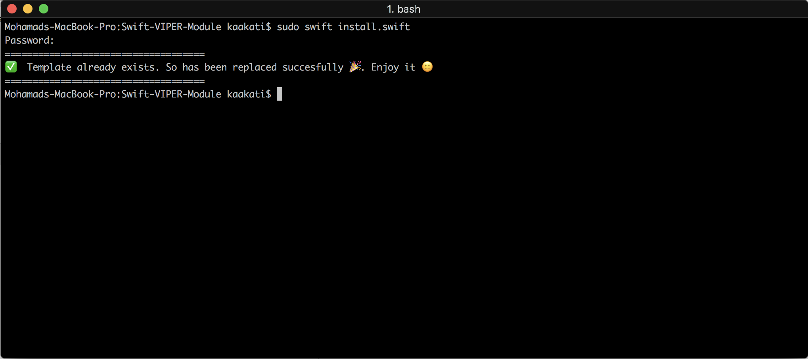

Are you new to VIPER Design Pattern? Want to Learn it But feel overwhelemed of all the files you have to create?

When you decide to use VIPER architecture in your project, it feels overwhelming to create new modules, because you need create at least 5 files for each. Imagine that you need to create 6 modules...We were suffering of this problem, and this is the reason why We've created this template. It's very useful for us and I hope that it be useful for you too.

## Available Options:
* [x] BaseViewProtocol - A Common Functions Placeholder.
----
* [x] With Generic Functions - Protocols with Generic Functions ready for implementation.
* [x] Without Generic Functions.

### UI Ready Implementation.
* [x] Both Options With & Without Generic Functions contains a UI file ready for Implemntation.

## How to install

#### Using script (easy)
Only need execute this command in terminal:
```swift
sudo swift install.swift
```

## Generated code
This template generates all files that you need to create a new VIPER module. All generated code is Swift 4.

```swift
YourFileNameUI for UI as UIView instead of Storyboards.
VYourFileName for View.
IYourFileName for Interactor.
PYourFileName for Presenter.
EYourFileName for Entity.
RYourFileName for Router (Wireframe).
```

You should be this output message:



If all it's ok you now could find your template in Xcode.

### Manual
Go to Application folder, browse to the Xcode application icon. Right-click it and choose 'Show Package Contents'. Then browse to:
`Contents/Developer/Platforms/iPhoneOS.platform/Developer/Library/Xcode/Templates/Project Templates/iOS/Application` and add "Module VIPER.xctemplate" file. Now you can find your template in Xcode.

## Easy to use


## VIPER diagram overview


## VIPER Checklist
To get started easier, we’ve prepared a list of notes to make sure everything follows the VIPER’s design principle. We hope this will be useful to you also as we find it to be.

* [ ] Views and view controllers receive user interactions and pass them to presenters for decision making
* [ ] Presenters contain the view logics and prepare content for display and reacting to user inputs
* [ ] Presenters should not know about the existence of all UIViews
* [ ] Interactors contain business logics and they should be independent of UI
* [ ] Entities are  model objects manipulated by Interactors
* [ ] Wireframe is the only place to define screen navigations and their transition animations

## What is VIPER?
#### VIEW
The view consists of views and view controllers. It is responsible to receive user interactions and pass them to presenters for decision making. To keep the view simple, it shouldn’t contain any view logics. This is where to define how the view looks like, and nothing beyond this.

#### PRESENTER
The presenter defines the view logics, e.g. when to show a warning message or highlight a button. It is responsible to prepare content for the view to display. Whenever data is required, the presenter requests data from interactors (but not directly from the model).

#### INTERACTOR
The interactor mainly contains business logic, e.g. logging in the user /  processing a purchase / sending a friend request. It should be independent of the UI. It only handles requests from the presenter and prepare corresponding data regardless of how the view looks like.

#### ENTITY
Entities are the model objects manipulated by an Interactor and only by the Interactor. It is simply an NSManagedObject. It is model orientated and therefore should not contain any business logic.
Something like  is not supposed to be placed inside an Entity.

#### ROUTING (WIREFRAME)
Wireframe defines the routes from one screen to another. In VIPER, the responsibility for Routing is shared between the presenter and the wireframe.
When the presenter receives user interactions and decided to navigate to another screen, it will use the wireframe to perform the desired navigation (to which screen and how to navigate). The wireframe can also contain transition animations.

## Why VIPER?
After using VIPER, I've found it to be very beneficial in many ways. Let’s get back to the list of things we set out to accomplish when architecting our app to see if VIPER addresses them.

- Single responsibility principles applied.
- Easy to iterate on.
- Collaboration friendly.
- Separated out concerns.
- Spec-ability.
- Testability. 

## Next steps

Would you like decide what will be the next feature?

* [x] Create bash script to install more easy
* [x] Divide Interactor protocol (Input & Output) (**NEW!** Version 1.1)
* [x] Swift 4 & XCode 9 (**NEW!** Version 1.2)
* [ ] Create Data Layer for Interactor Implementations.

## References
- [iOS Architecture Patterns](https://medium.com/ios-os-x-development/ios-architecture-patterns-ecba4c38de52#.ba7q8dcih)
- [#8 VIPER to be or not to be?](https://swifting.io/blog/2016/03/07/8-viper-to-be-or-not-to-be/)
- [https://www.objc.io/issues/13-architecture/viper/](https://www.objc.io/issues/13-architecture/viper/)
- [https://www.ckl.io/blog/ios-project-architecture-using-viper/](https://www.ckl.io/blog/ios-project-architecture-using-viper/)

## Contributed
This is an open source project, so feel free to contribute. How?
- Open an [issue](https://github.com/Kaakti/VIPER-Module-Generator/issues/new).

## Authors

* [Mohamad Kaakati](https://www.twitter.com/kaakati)
* [Qutaibah Essa](https://www.twitter.com/qutaibah)
